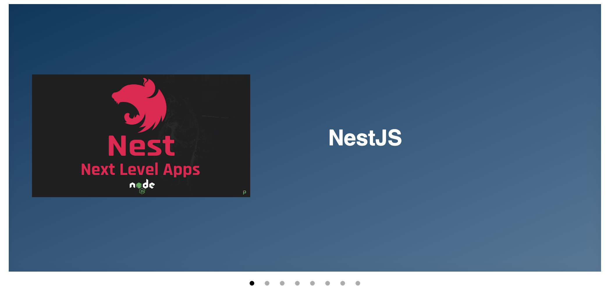

# wordpress-webcomponent-slider-demo

Example the integration Wordpress Loop + Web Components

The web components is the standard for reusable y custom tags.

A web component can use inside PHP, HTML, React, Angular Vue or Svelte.

